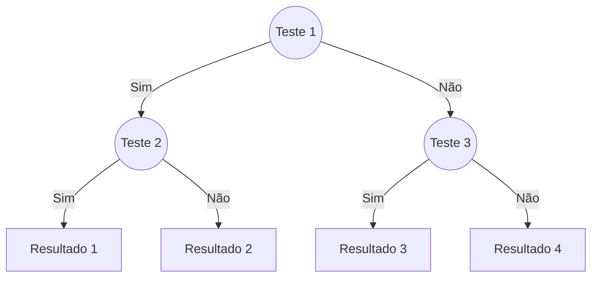

As **árvores de decisão** são uma técnica popular de **aprendizado de máquina supervisionado** usada para classificação e regressão. Elas representam decisões e suas possíveis consequências em uma estrutura hierárquica, facilitando a interpretação dos resultados.



???+ example "Exemplo: ir para praia ou não?"

    Após dias de anotações sobre o comportamento de uma pessoa, foi possível criar uma tabela com os seguintes registros:

    | Dia | Sol? | Vento? | Praia? |
    |:---:|:----:|:------:|:------:|
    | 1   | Sim  | Sim    | Não    |
    | 2   | Sim  | Sim    | Não    |
    | 3   | Sim  | Não    | Sim    |
    | 4   | Não  | Não    | Não    |
    | 5   | Não  | Sim    | Não    |
    | 6   | Não  | Não    | Não    |

    A partir desses dados, podemos construir uma árvore de decisão para prever se a pessoa irá à praia com base nas condições climáticas.

    ``` mermaid
    graph TD;
        A((Sol?)) -->|Sim| B((Vento?))
        A -->|Não| C[Não ir à praia]
        B -->|Sim| D[Não ir à praia]
        B -->|Não| E[Ir à praia]
    ```
    /// caption
    Árvore de decisão simples para prever se a pessoa irá à praia com base nas condições climáticas. A partir da pergunta "Sol?", a árvore se divide em dois caminhos: se há sol, verifica-se se há vento. Se não há sol, a decisão é não ir à praia. Se não há vento, a decisão é ir à praia. Fonte: [Didatica Tech - Árvores de Decisão](https://didatica.tech/como-funciona-o-algoritmo-arvore-de-decisao/){:target="_blank"}.
    ///

## Considerações

!!! success "Vantagens"

    - **Interpretação fácil**: A estrutura em árvore facilita a visualização e compreensão das decisões tomadas pelo modelo.
    - **Não requer normalização**: Árvores de decisão não são sensíveis à escala dos dados, o que significa que não é necessário normalizar ou padronizar as variáveis.
    - **Capacidade de lidar com dados categóricos e numéricos**: Elas podem trabalhar com ambos os tipos de dados sem necessidade de transformação prévia.

!!! failure "Desvantagens"

    - **Tendência ao overfitting**: Árvores de decisão podem se ajustar demais aos dados de treinamento, capturando ruídos e padrões irrelevantes.
    - **Instabilidade**: Pequenas variações nos dados podem resultar em árvores completamente diferentes, tornando o modelo menos robusto.

## Nomenclatura

As árvores de decisão são compostas por **nós** (representando testes em atributos) e **folhas** (representando resultados ou classes finais). O processo de construção da árvore envolve a seleção do atributo mais informativo para dividir os dados em subconjuntos, minimizando a impureza (e.g., usando medidas como entropia ou índice Gini)[^1].


/// caption
Estrutura de uma Árvore de Decisão: os nós representam testes em atributos, enquanto as folhas representam os resultados finais. Fonte: [Aulas - Árvores](https://saulo.arisa.com.br/wiki/index.php/%C3%81rvores){:target="_blank"}.
///

O objetivo de uma árvore de decisão é criar uma estrutura que minimize a impureza dos nós, resultando em folhas que contenham exemplos da mesma classe ou com valores semelhantes. Isso é feito através de um processo iterativo de divisão dos dados, onde em cada nó é escolhido o atributo que melhor separa os dados em termos de classe ou valor.

Existem algumas métricas comuns usadas para medir a qualidade de uma divisão, incluindo:

- **Índice Gini**: Mede a impureza dos dados, onde um valor de 0 indica pureza total (todos os exemplos pertencem à mesma classe).
- **Entropia**: Mede a incerteza ou aleatoriedade dos dados, onde uma entropia de 0 indica que todos os exemplos pertencem à mesma classe.
- **Ganho de Informação**: Mede a redução da entropia após a divisão dos dados.
- **Redução da Variância**: Usada em árvores de decisão para regressão, mede a redução da variância dos valores após a divisão dos dados.
- **Chi-quadrado**: Usado para medir a independência entre variáveis categóricas, ajudando a identificar interações significativas entre atributos.


Para o cálculo do coeficiente de Gini (mais usado em árvores de decisão):

$$
g_i = 1 - \sum_{i=1}^{n} p_i^2
$$

onde \( p_i \) é a proporção de cada classe \( i \) no conjunto de dados.

Mais baixo a impureza, mais puro o nó.


## Construção

Neste exemplo, temos um conjunto de dados sobre transações financeiras, onde cada transação é classificada como "Fraude" ou "Normal". A árvore de decisão pode ser usada para prever se uma nova transação é fraudulenta ou não, com base em características como o valor da transação e o período.

!!! example "Fraude"

=== "data sample (20/38)"

    ```python exec="1"
    --8<-- "docs/classes/decision_tree/fraude_dataset.py"
    ```

=== "plot"

    ```python exec="1" html="1"
    --8<-- "docs/classes/decision_tree/fraude_plot.py"
    ```

Para construir a árvore de decisão, os dados são divididos em nós com base nas características mais informativas, minimizando a impureza dos nós. Para construir a árvore, o algoritmo avalia cada atributo e escolhe aquele que melhor separa as classes, utilizando métricas como o índice Gini ou entropia.

### Passo a passo

1. Definir o nó com os dados daquele ramo.
2. Calcular a impureza de cada atributo.
3. Escolher o atributo que melhor separa os dados.
4. Dividir os dados com base no atributo escolhido.
5. Repetir o processo para cada subconjunto até que um critério de parada seja atendido (e.g., todos os exemplos em um nó pertencem à mesma classe ou um número mínimo de exemplos é atingido).

Para definir o nó raiz, o algoritmo avalia todos os atributos e calcula a impureza de cada um. O atributo com a menor impureza é escolhido como o nó raiz. Em seguida, os dados são divididos com base nesse atributo, criando ramos na árvore. O processo é repetido recursivamente para cada ramo até que todos os nós sejam folhas (ou seja, não possam ser divididos mais).

| Feature | | Sim | Não |
|:-------|:--|:---:|:---:|
| Valor >= 3000   | | 18 | 20 |
| | Fraude        | 5 | 1  |
| | Normal        | 13 | 19 |
| Periodo = Noturno | | 14 | 24 |
| | Fraude        | 4 | 2  |
| | Normal        | 10 | 22 |

Cálculo do índice de Gini para cada critério sobre atributos:

$$
\text{Gini}(\text{Critério}) = 1 - \left(\frac{fraude}{fraude + normal}\right)^2 - \left(\frac{normal}{fraude + normal}\right)^2 
$$

=== "Valor >= 3000"

    $$
    \text{Gini}(\text{Valor}\geq 3000) = 1 - \left(\frac{5}{18}\right)^2 - \left(\frac{13}{18}\right)^2 = 0.4012
    $$

    $$
    \text{Gini}(\text{Valor} < 3000) = 1 - \left(\frac{1}{20}\right)^2 - \left(\frac{19}{20}\right)^2 = 0.0950
    $$

    Normalizando os valores, temos:

    $$
    \text{Pureza do nó} = \frac{\text{18}}{38} \cdot 0.4012 + \frac{20}{38} \cdot 0.0950 = 0.2401
    $$

=== "Periodo = Noturno"

    $$
    \text{Gini}(\text{Periodo} = \text{Noturno}) = 1 - \left(\frac{4}{14}\right)^2 - \left(\frac{10}{14}\right)^2 = 0.4082
    $$

    $$
    \text{Gini}(\text{Periodo} \neq \text{Noturno}) = 1 - \left(\frac{2}{24}\right)^2 - \left(\frac{22}{24}\right)^2 = 0.1528
    $$

    Normalizando os valores, temos:

    $$
    \text{Pureza do nó} = \frac{\text{14}}{38} \cdot 0.4082 + \frac{24}{38} \cdot 0.1528 = 0.2469
    $$

Árvore de decisão resultante pode ser representada da seguinte forma:


=== "Árvore construída"

    --8<-- "docs/classes/decision_tree/fraude_tree.md"

=== "decision tree"

    ```python exec="1" html="1"
    --8<-- "docs/classes/decision_tree/fraude_decision_tree.py"
    ```

=== "code"

    ```python exec="0"
    --8<-- "docs/classes/decision_tree/fraude_decision_tree.py"
    ```

### Implementação com Bibliotecas

As árvores de decisão podem ser implementadas usando bibliotecas populares como `scikit-learn` em Python, que oferece uma interface simples para criar e treinar modelos de árvores de decisão. A seguir é um exemplo básico de como criar uma árvore de decisão para classificação:

!!! example "Iris Dataset"

=== "output"

    ```python exec="1" html="1"
    --8<-- "docs/classes/decision_tree/iris_decision_tree.py"
    ```

=== "dataset"

    ```python exec="1"
    --8<-- "docs/classes/decision_tree/iris_dataset.py"
    ```

=== "code"

    ```python exec="0"
    --8<-- "docs/classes/decision_tree/iris_decision_tree.py"
    ```

!!! example "Titanic Dataset"

=== "decision tree"

    ```python exec="1" html="true"
    --8<-- "docs/classes/decision_tree/titanic_decision_tree.py"
    ```

=== "dataset"

    ```python exec="1"
    --8<-- "docs/classes/decision_tree/titanic_dataset.py"
    ```

=== "code"

    ```python exec="0"
    --8<-- "docs/classes/decision_tree/titanic_decision_tree.py"
    ```

---

## Exercício

!!! success inline end "Entrega"

    :calendar: **29.ago** :clock3: **9:00**

    :material-account: Individual

    :simple-target: Entrega do link via [Canvas](https://canvas.espm.br/){:target="_blank"}.

Dentre os [datasets disponíveis](/ml/classes/concepts/data/data/#datasets){:target="_blank"}, escolha um cujo objetivo seja prever uma variável categórica (classificação). Utilize o algoritmo de árvore de decisão para treinar um modelo e avaliar seu desempenho.

Utilize as bibliotecas `pandas`, `numpy`, `matplotlib` e `scikit-learn` para auxiliar no desenvolvimento do projeto.

A entrega deve ser feita através do [Canvas](https://canvas.espm.br/) - **Exercício Árvore de Decisão**. Só serão aceitos links para repositórios públicos do GitHub contendo a documentação (relatório) e o código do projeto. Conforme exemplo do [template-projeto-integrador](https://hsandmann.github.io/documentation.template/){:target="_blank"}. ESTE EXERCÍCIO É INDIVIDUAL.

A entrega deve incluir as seguintes etapas:

| Etapa | Critério | Descrição | Pontos |
|:-----:|----------|-----------|:------:|
| 1 | Exploração dos Dados | Análise inicial do conjunto de dados - com explicação sobre a natureza dos dados -, incluindo visualizações e estatísticas descritivas. | 20 |
| 2 | Pré-processamento | Limpeza dos dados, tratamento de valores ausentes e normalização. | 10 |
| 3 | Divisão dos Dados | Separação do conjunto de dados em treino e teste. | 20 |
| 4 | Treinamento do Modelo | Implementação do modelo Decision Tree. | 10 |
| 5 | Avaliação do Modelo | Avaliação do desempenho do modelo utilizando métricas apropriadas. | 20 |
| 6 | Relatório Final | Documentação do processo, resultados obtidos e possíveis melhorias. **Obrigatório:** uso do template-projeto-integrador, individual. | 20 |

---

## Adicional

{ type=application/pdf style="min-height:45vh;width:100%" }


[^1]: [Aulas - Árvores](https://saulo.arisa.com.br/wiki/index.php/%C3%81rvores){:target="_blank"}
[^2]: [Didatica Tech - Árvores de Decisão](https://didatica.tech/como-funciona-o-algoritmo-arvore-de-decisao/){:target="_blank"}