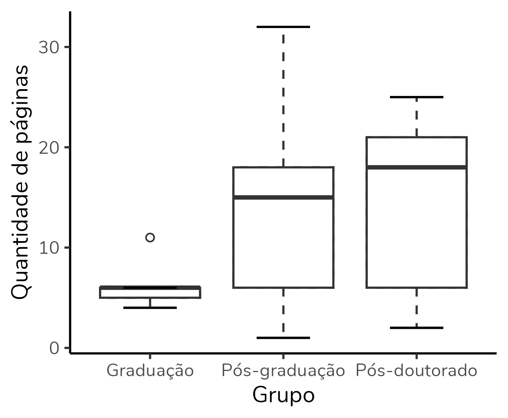
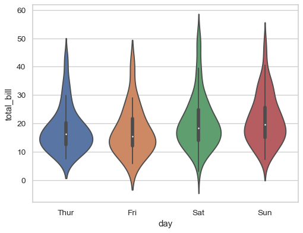
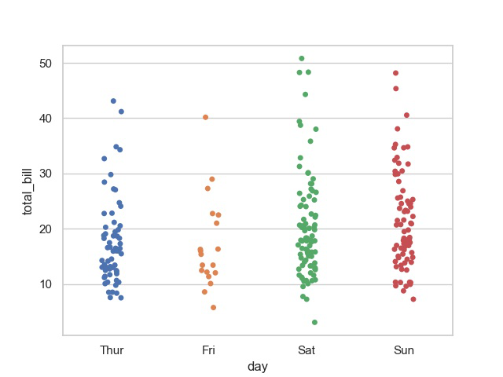
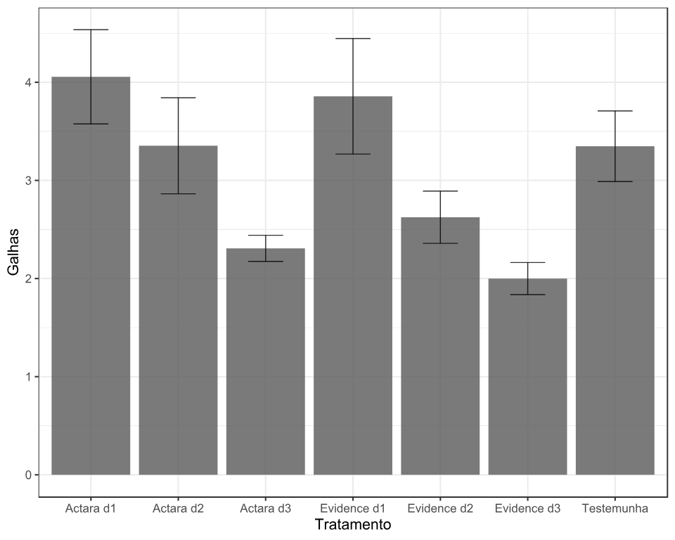

# Gráficos de Visualização de Dados

| Combinação de Variáveis                                             | Gráficos Recomendados                                                           | Quando Usar                                                            |
| ------------------------------------------------------------------- | ------------------------------------------------------------------------------- | ---------------------------------------------------------------------- |
| **Categórica (binária/nominal)** × **Numérica (discreta/contínua)** | Boxplot • Violin Plot • Strip/Swarm Plot • Barras com média                     | Comparar distribuições entre categorias (ex.: churn vs. total charges) |
| **Numérica × Numérica**                                             | Scatter Plot • Heatmap de Correlação • Linha (se houver tempo) • Hexbin/Density | Analisar relação linear, padrões, clusters, correlação                 |
| **Categórica × Categórica**                                         | Barras agrupadas • Barras empilhadas • Heatmap de frequência • Mosaic Plot      | Comparar proporções entre categorias (ex.: gênero × churn)             |
| **Numérica × Tempo (datas)**                                        | Linha • Scatter temporal • Boxplot por período                                  | Detectar tendências, sazonalidade e variações ao longo do tempo        |
| **Univariado Numérico**                                             | Histograma • Boxplot • KDE                                                      | Estudar distribuição, outliers e forma da curva                        |
| **Univariado Categórico**                                           | Gráfico de Barras • Pizza (menos recomendado)                                   | Ver frequência, proporções e categorias dominantes                     |

## Dicas para Criação de Gráficos

- **Escolha o gráfico certo**: Use o gráfico que melhor representa a relação entre as variáveis.
- **Mantenha a simplicidade**: Evite excesso de informações que possam confundir o leitor.
- **Use cores com propósito**: Utilize cores para destacar informações importantes, mas evite exageros.
- **Adicione títulos e legendas claras**: Facilite a compreensão do gráfico com títulos descritivos e legendas explicativas.
- **Considere o público-alvo**: Adapte o nível de detalhe e complexidade do gráfico ao público que irá analisá-lo.

## Variável Categórica vs. Numérica

Quando se deseja analisar a relação entre uma variável categórica (como gênero, região, status de churn) e uma variável numérica (como receita, idade, tempo de uso), os gráficos mais indicados são:

- **Boxplot**: Excelente para visualizar a distribuição da variável numérica em cada categoria, mostrando mediana, quartis e possíveis outliers.

- **Violin Plot**: Similar ao boxplot, mas também mostra a densidade da distribuição da variável numérica em cada categoria.Bom quando você quer destacar a forma da distribuição.

- **Strip/Swarm Plot**: Mostra todos os pontos de dados individuais, útil para visualizar a dispersão dentro de cada categoria. Ótimo quando a variável numérica é discreta.

- **Barras com média**: Gráfico de barras que representa a média da variável numérica para cada categoria, útil para comparações rápidas. Útil quando a variável discreta tem poucos valores.

## Variável Númerica vs. Numérica

Os gráficos mais indicados são:

- **Scatter Plot**: serve para analisar a relaçõa direta entre duas variáveis.

- **Heatmap de correlação**: é útil quando temos muitas variáveis.

- **Hexbin/Density**: é bom quando temos muitos pontos sobrepostos.

## Variável Categórica vs. Categórica

- **Barras agrupadas ou empilhadas** → comparação simples.

- **Heatmap de frequência** → “tabela cruzada” visual.

- **Mosaic Plot** → visualização proporcional de contingências.

## Variável Numérica vs. Tempo

- **Linha** → melhor para séries temporais contínuas.

- **Boxplot por período** → comparar distribuições entre meses / semanas.

- **Scatter temporal** → quando há ruído ou outliers importantes.

## Variáveis Univariadas

- **Numérica:** Histograma, KDE, Boxplot

- **Categórica:** Barras (preferível), Pizza (quando poucas categorias)
